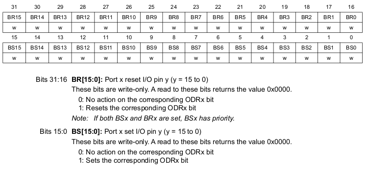
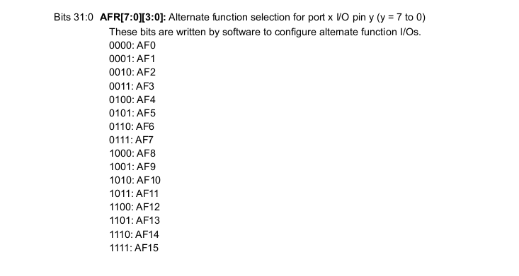

# Renode startup guide

Renode is a tool for hardware(HW) simulation. HW can be described on .repl files,
such as peripheral properties, mem space and pins linkage.

## Dependencies for Ubuntu 20.04 LTS

```sh
sudo apt install mono-complete

sudo apt-get install policykit-1 libgtk2.0-0 screen uml-utilities gtk-sharp2 libc6-dev gcc python3 python3-pip
```

## Instalation

The instalation of renode could be done by
 [git rep.](https://github.com/renode/renode/releases/tag/v1.12.0), compilation
 and instalation:

 ```sh
git clone https://github.com/renode/renode
cd renode

git submodule update --init --recursive

# -v Verbose flag
./build.sh -v
 ```

## Plataforms

In renode environment there's those .repl files used to describe hardware architecture, such as special properties, memory allocation and linkage with other parts of hardware. Generaly it's described as peripherals, [here](https://renode.readthedocs.io/en/latest/advanced/platform_description_format.html) there is an explanation on the systax.

Renode have some chips and boards implemented already, though it's possible to describe your own hardware, [here](https://renode.readthedocs.io/en/latest/advanced/writing-peripherals.html) there's a guide to describe custom peripherals.

## Usage

When you run:
```sh
# Must be on PATH
renode
```
A terminal like GUI is open, and it seems like this:


There machines could be created, runned and dellete. For more information please refere to [this](https://renode.readthedocs.io/en/latest/introduction/using.html). You also can run your first `demo`, what is decribed [here](https://renode.readthedocs.io/en/latest/introduction/demo.html).

## Creating a custom peripheral C#

This project have few implementations yet, so for general use, you must implement your hardware somehow. Here using a implementation as example, we try to exaplain how peripheral implementation works.

Using a GPIO as reference from `/renode/src/Infrastructure/src/Emulator/Peripherals/Peripherals/GPIOPort/`, beggining with it's properties:


- DoubleWordRegister (`DWR`) is the base class for any 32 bits register, and DoubleWordRegisterCollection (`DWRC`) is a set of `DWR`.
- PinMode type is basicaly the pin input and output modes possibilities on a enum type.
- Registers type is a set of offsets from the peripheral offset for each register.

GPIOport constructor is presented on the following image:


On this example `pins` and `registers` are defined, highlighting the `WithValueField(...)` method. The fields on registers and its actions are defined here by the callback functions. Like in the following image, multiple fields can be defined on each `WithValueField(...)` call.


For reference, the `WithValueField(...)` params order and explanation as following:


### Implementing STM32H750xB GPIO peripheral

Following the especification of each GPIO register for STM32H750xB and renodes implementation:


---


---


---


---


---




---


---




---


